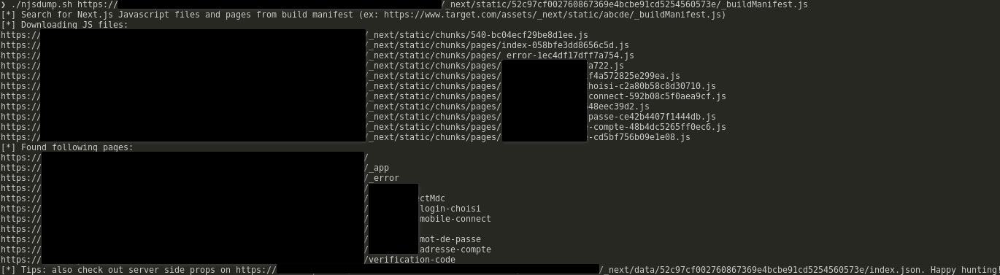

# njsdump

Simple script for dumping paths &amp; pages from Next.js Manifest

## Usage

```bash
./njsdump.sh https://www.target.com/assets/_next/static/abcde/_buildManifest.js
```

## Result



JS files will be saved into `output/target.com/` directory.

## Tip: beautify JS

With [https://github.com/beautifier/js-beautify](https://github.com/beautifier/js-beautify):

```bash
js-beautify output/www.target.com/*
```
